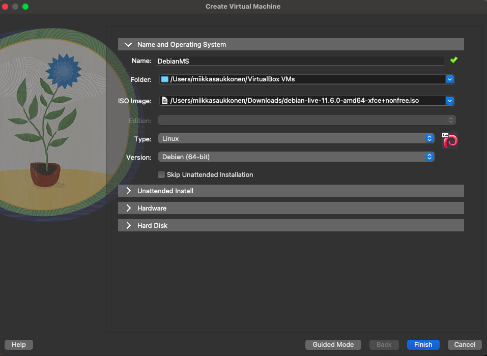
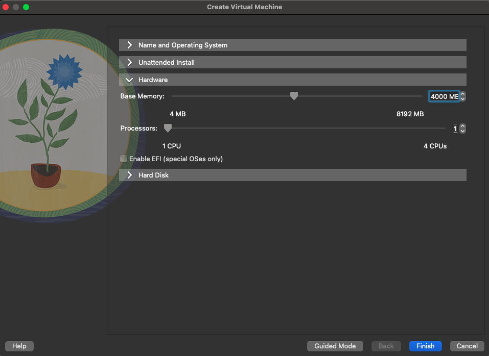
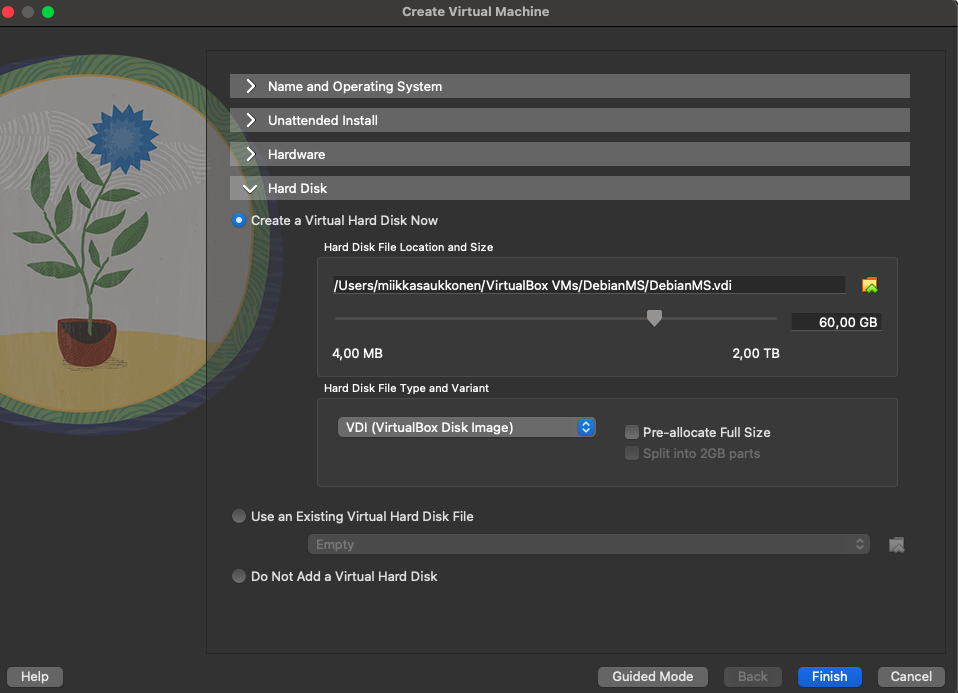
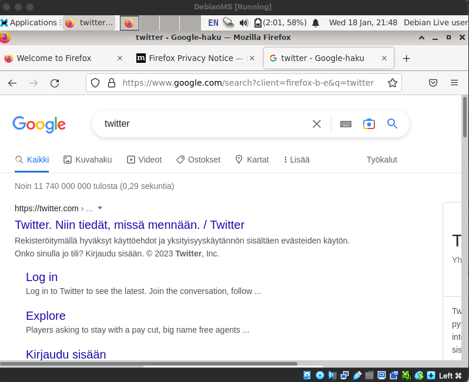
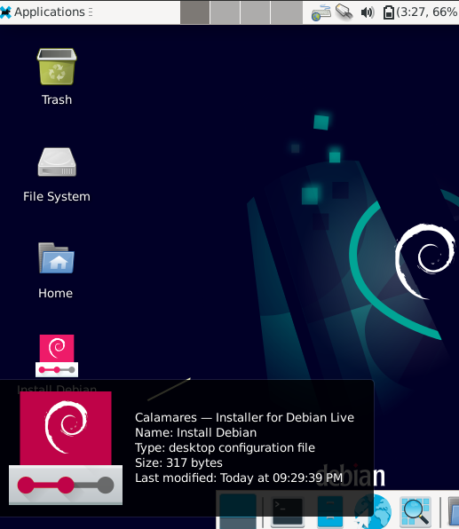
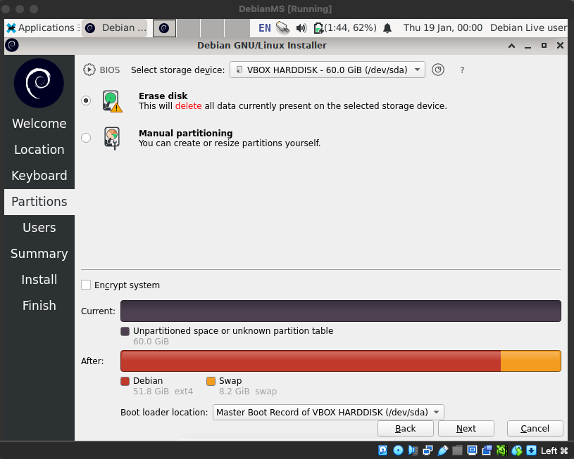
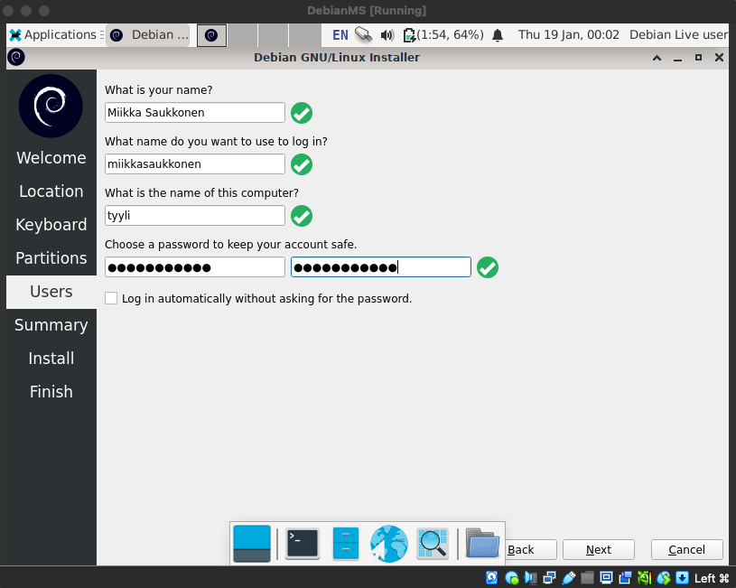
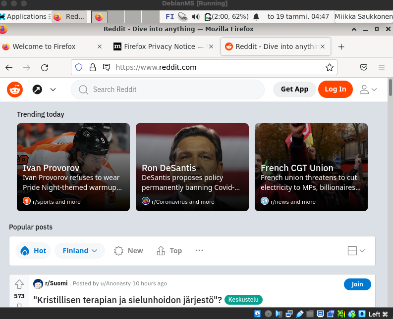

# h1 Virtuaali-Linux tehtävä
## Tehty MacBook Air(2015) macOS Monterey käyttöjärjestelmällä(Intel i5 prosessori)
- Aloitin lataamalla Debianin valmiiksi koneelle tehtävän tekemistä varten.(Versio: debian-live-11.6.0-amd64-xfce+nonfree.iso)
- Latasin samalla myös VirtualBox:in läppärille.(macOS, Intel prosessoreille tarkoitettu versio). 

- 21:16 VirtualBoxissa painoin Create Virtual Machine ja valitsin expert mode. Valitsin nimen, kansion, ISO Imagen, Tyypin sekä Version. Klikkasin myös "Skip Unattended Installation" ja jätin kyseisen vaiheen välistä.
  

- 21:20 Täytin vaiheittain loput vaiheet: 

### Hardware

### Hard Disk

  
- 21:28 Varmistin valintani, jonka jälkeen painoin Finish nappia.
- 21:30 Tarkistin VirtualBoxista luomani virtuaalikoneen asetuksista(settings painike yläreunassa) "storage" kohdasta vielä, että Controller: IDE kohdan alle oli varmasti päivittynyt ISO Image oikein(debian-live-11.6.0-amd64-xfce+nonfree.iso).

- Tämän jälkeen käynnistin virtuaalikoneen painamalla Start painiketta.

- Käynnistyessä avautui menu, josta valitsin ylimmän "Debian GNU/Linux Live..." painamalla Enter näppäintä.

- 21:45 Virtuaalikoneen Linuxin työpöytä avautui. Avasin vasemmasta yläkulmasta sovelluksista verkkoselaimen(Web Browser) ja tein googleen haun Twitter. Kaikki toimi normaalisti.

### Asennus Debian GLU/Linux installer (Calamares) avulla

- 23:52 Avasin Calamares Installerin työpöydän vasemmasta alakulmasta.

  

- Kävin asennuksen vaiheet läpi.

- Valitsin sijainniksi Eurooppa, Helsinki

- Näppäimistön määrittelyyn laitoin valinnat:
    Generic 105-key PC (intl.), Finnish & Finnish (Macintosh)
  
#### Partitions vaihe

  
  
#### Users käyttäjän luominen

  

- 00:05 Users vaiheesta etenin yhteenvetoon, jonka jälkeen jatkoin asennukseen painamalla Install nappia oikeasta alakulmasta.

- Jätin koneen asentamaan.

- 00:20 Asennuksen päätyttyä käynnistin järjestelmän uudelleen valitsemalla Restart Now ja painamalla Done-näppäintä oikeasta alareunasta.

- Uudelleenkäynnistyksen jälkeen avautui kirjautumissivu.

- Kirjauduin aikaisemmin luomillani tunnuksilla sisään.
  
- 00:30 Testasin verkkoselaimen toiminnan avaamalla Redditin hakukoneesta ja kaikki toimi normaalisti.

  
  
### Lopuksi päivitykset

- 00:40 Terminaalista hain kaikki saatavilla olevat päivitykset syöttämällä komennon.

      $ sudo apt-get update
    
- syötin salasanan, kun sitä kysyttiin.

- Ajoin kaikki päivitykset syöttämällä komennon:

      $ sudo apt-get -y dist-upgrade
    
- 00:45 Asensin vielä palomuurin sekä otin sen käyttöön seuraavilla komennoilla

      $ sudo apt-get -y install ufw
      $ sudo ufw enable
    
- lopuksi käynnistin vielä järjestelmän uudelleen ja tarkistin, että kaikki on kunnossa testaamalla verkkoselaimen toiminnan.

Ohjeet päivityksien sekä palomuurin asentamiseen katsoin seuraavalta verkkosivulta Karvinen, Tero 2023-01-17, Install Debian on Virtualbox. Luettavissa: https://terokarvinen.com/2021/install-debian-on-virtualbox/

  

