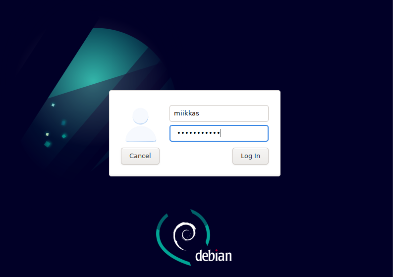

# h1 Virtuaali-Linux tehtävä
## Tehty MacBook Air(2015) macOS Monterey käyttöjärjestelmällä(Intel i5 prosessori)
- Aloitin lataamalla Debianin valmiiksi koneelle tehtävän tekemistä varten.(Versio: debian-live-11.6.0-amd64-xfce+nonfree.iso)
- Latasin samalla myös VirtualBox:in läppärille.(macOS, Intel prosessoreille tarkoitettu versio). 

23:16 - VirtualBoxissa painoin Create Virtual Machine ja valitsin expert mode. Valitsin nimen, kansion, ISO Imagen, Tyypin sekä Version. Klikkasin myös "Skip Unattended Installation" ja jätin kyseisen vaiheen välistä.
  
  

23:20 - Kävin vaiheittain loput vaiheet: 

#### Hardware

  

#### Hard Disk

  
  
- 23:28 Varmistin valintani, jonka jälkeen painoin Finish nappia. Tämän jälkeen Debian käynnistyi automaattisesti.
- Käynnistyksessä kaikki tapahtui automaattisesti itsestään ilman, että jouduin painamaan mitään.

- 23:35  Avasin vasemmasta yläkulmasta sovelluksista Web Browser ja tein googleen haun Twitter. Kaikki toimi normaalisti.

  

### Asennus Debian GLU/Linux installer (Calamares) avulla

- 23:45 Avasin Calamares Installerin työpöydän vasemmasta alakulmasta.

  

- Kävin asennuksen vaiheet läpi.

- Valitsin sijainniksi Eurooppa, Helsinki

- Näppäimistön määrittelyyn laitoin valinnat:
    Generic 105-key PC (intl.), Finnish & Finnish (Macintosh)
  
#### Partitions vaihe

  
  
#### Users käyttäjän luominen

  

- 23:58 Users vaiheesta etenin yhteenvetoon, jonka jälkeen jatkoin asennukseen painamalla Install nappia oikeasta alakulmasta.

- 00:15 Asennuksen päätyttyä käynnistin järjestelmän uudelleen valitsemalla Restart Now ja painamalla Done nappia oikeasta alareunasta.

- Uudelleenkäynnistyksen jälkeen avautui kirjautumissivu.

- Kirjauduin aikaisemmin luomillani tunnuksilla sisään

  
  
- 00:30 Testasin verkkoselaimen toiminnan avaamalla Redditin hakukoneesta ja kaikki toimi normaalisti.

  

